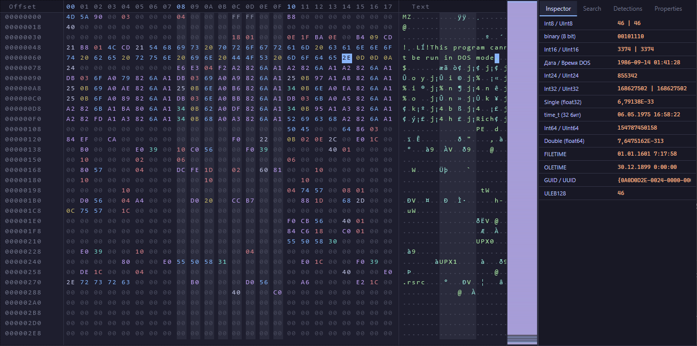
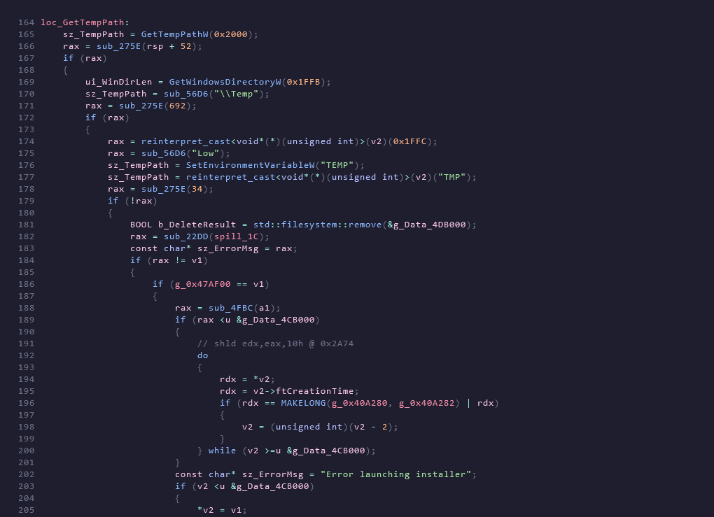
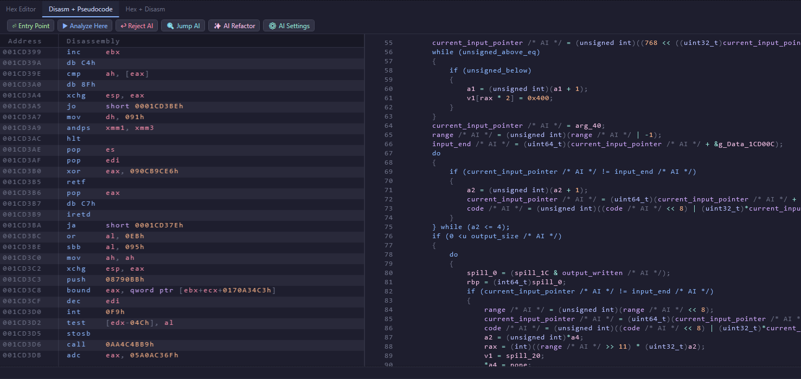

<p align="center">
  
</p>

## 🌌 EUVA IDE

<p align="center">

  
  
  
</p>

<p align="center">
  <strong>The next generation of binary reverse engineering. Slice through protection, recover semantics, and reclaim your code. </strong>
</p>

---


## 🔍 About EUVA


EUVA is not just a hex editor and decompiler – it's a comprehensive **Static Analysis Environment** designed for the modern reverse engineer. Born from the need for high-performance, scriptable, and intelligent binary analysis, EUVA combines traditional graph-theory algorithms with cutting-edge AI-assisted semantic recovery.

> [!IMPORTANT]
> EUVA is designed with a "Local First" philosophy. Every advanced feature, including the AI agent, is entirely optional and can be configured to run through local providers like Ollama.

---


## Disclaimer 

**This program is under active development. Experimental builds may contain bugs or lead to unexpected behavior. Use with caution.**

This software is provided "as is", without warranty of any kind. EUVA is a high-precision instrument designed for educational purposes and security research. The author is not responsible for any system instability, data loss, or legal consequences resulting from the misuse of this tool.

By using EUVA, you acknowledge that you are solely responsible for your actions, you understand the risks of modifying binary files and process memory, and you will respect the laws and regulations of your jurisdiction.

---

## ✨ Core Arsenal

### 1. 🧬 High-Performance Hex Editor
Experience binary data at its most primal level with a hardware-accelerated rendering engine. EUVA bypasses the standard WPF rendering pipeline to provide maximum performance.


<p align="center">
  
  <br>
  <em>Buttery smooth scrolling and instant data lookup at native DPI.</em>
</p>

### 2. ⚡ The Decompiler Engine
Pipeline that elevates raw machine code into human-readable C/C++ logic.

<p align="center">
  
</p>

### 3. 🔍 Advanced Disassembly
High-performance logical listing for precise low-level analysis.

<p align="center">
  
</p>


### 🧩 Extension & Analysis (Other)
EUVA is built to be "omnivorous" to new analysis methods.

<p align="center">
  
</p>

Yara rules and so on..

### 4. 🤖 AI-Agent Semantic Refactoring
Bridge the gap between **Logic** and **Semantics**. Our experimental AI layer helps you identify variable names and function roles that are traditionally lost in compilation.

> [!NOTE]
> **Your Choice, Your Control**: The AI Agent is a "Bring Your Own Key" system. It supports Cloud LLMs (OpenAI, Claude, Groq) and Local LLMs (Ollama, LocalAI). **Privacy is paramount.**


🟢 After AI (Semantic Refactor) 

---

<p align="center">
  
</p>

---

## 🛠 Features Spotlight

- **Memory-Mapped File engine** that scales to arbitrarily large binaries with zero heap pressure
- **WriteableBitmap renderer** that bypasses the WPF render pipeline entirely pixel-perfect output at native DPI
- **GlyphCache subsystem** that rasterizes each character once and blits it via direct memory copy thereafter
- **Dirty Tracking system** with lock-free snapshot reads for zero-latency change visualization
- **Transactional Undo system** both step-by-step (`Ctrl+Z`) and full-session rollback (`Ctrl+Shift+Z`)
- **structured PE decomposition layer** that turns raw bytes into a navigable semantic tree
- **DSL-language** A standalone language for replacing bytes in a hex editor with Python-like syntax.
- **scriptable patching DSL** (`.euv` format) with live file-watch execution
- **plugin-extensible detector pipeline** for packer/protector identification
- **fully themeable rendering layer** with persistent theme state across sessions
- **Addition of the Yara-X rules engine** which allows for matching against thousands of pre-built rules for binary file analysis.
- **Byte minimap** Allows you to instantly scan the hex grid of a binary file, simplifying research and instantly identifying where packed code or similar may be located.
- **Disassembler** An iced-based disassembler will help in analyzing binary files and will present the binary file as readable logic.
- **Decompiler** Decompile x64, x86 binaries and get pseudocode in C/C++ format
- **Scripting Decompiler** A C# scripting layer that allows you to write custom decompiler scripts and custom decompilation methods.
- **AI Agents Decompiler** Bring your own API key Cloud or Local via Ollama to instantly restore human-readable variable names and code semantics without UI freezes.
- **AI-Explain** Now AI can roughly explain decompiled code to you, giving you answers as high-quality as possible. (Experimental feat)


---

## 🚀 Quick Start

### Prerequisites

Before building, make sure you have the following installed:

| Requirement | Version | Link |
| :--- | :--- | :--- |
| .NET SDK | 8.0+ | [download](https://dotnet.microsoft.com/en-us/download/dotnet/8.0) |
| Windows OS | 10 / 11 | Required (WPF) |

> [!NOTE]
> EUVA is a **Windows-only** application built on WPF. Linux/macOS are not currently supported.

### Installation
```bash
# 1. Clone the repository
git clone https://github.com/pumpkin-bit/EUVA.git
cd EUVA/EUVA.UI

# 2. Restore dependencies
dotnet restore

# 3. Build in Release mode
dotnet build -c Release

# 4. Run (optional, or launch the compiled binary directly)
dotnet run -c Release
```

### First Launch

1. Open a binary file via **File → Open** or drag-and-drop onto the window
2. You can change bytes in a hex editor using an internal DSL language.
3. Press `Ctrl+D` to open the **Disassembler**, `Ctrl+E` for the **Decompiler**
4. *(Optional)* Configure your AI provider in **AI Settings** in the decompiler window to enable semantic refactoring


---

## 📚 Documentation & Depth

Dive deeper into the theory and mechanics:

- 📖 [Memory-Mapped-File](docs/MemoryMappedFile.md)
- 📖 [WriteableBitmap Render](docs/WriteableBitmapRenderer.md)
- 📖 [GlyphCache](docs/GlyphCache.md)
- 📖 [Dirty-Tracking-System](docs/DirtyTrackingAndSnapshot.md)
- 📖 [Transactional-Undo-system](docs/UndoSystem.md)
- 📖 [Structured-PE-decomposition-layer](docs/PESemanticTree.md)
- 📖 [DSL-language](docs/DSL.md)
- 📖 [scriptable-patching-DSL](docs/EuvFIleWatch.md)
- 📖 [plugin-extensible-detector-pipeline](docs/Detectors.md)
- 📖 [fully-themeable-rendering-layer](docs/Themes.md)
- 📖 [Addition-of-the-Yara-X-rules-engine](docs/EuvaUseYaraX.md)
- 📖 [Byte-minimap](docs/byteminimap.md)
- 📖 [Disassembler](docs/Disassembler.md)
- 📖 [Decompiler](docs/Decompiler.md)
- 📖 [Scripting-Decompiler](docs/Decompiler.md#19-glass-engine-c-scripting-integration)
- 📖 [AI-Agents-Decompiler](docs/Decompiler.md#20-ai-assisted-semantic-integration)

---
## ⌨️ Default Hotkey

| Command | Shortcut | Description |
| :--- | :--- | :--- |
| `NavInspector` | `Alt+1` | Switch to Inspector tab |
| `NavSearch` | `Alt+2` | Switch to Search tab |
| `NavDetections` | `Alt+3` | Switch to Detections tab |
| `NavProperties` | `Alt+4` | Switch to Properties tab |
| `CopyHex` | `Ctrl+C` | Copy selection as hex string |
| `CopyCArray` | `Ctrl+Shift+C` | Copy selection as C byte array |
| `CopyPlainText` | `Ctrl+Alt+C` | Copy selection as Plain text |
| `Undo` | `Ctrl+Z` | Undo last byte write |
| `FullUndo` | `Ctrl+Shift+Z` | Revert entire last script run |
| `View byte` | `F3` | View the latest bytes changes |
| `View Yara Matches` | `Shift+F3` | View matches found by Yara |
| `View Disassembler` | `Ctrl+D` | View Disassembler |
| `View Decompiler` | `Ctrl+E` | View Decompiler, use `F5` to switch between graphics mode and text mode |
| `Highlight code` | `Ctrl+A` | Selecting code in text form in a decompiler |
| `Function table` | `Ctrl+R` | show function table in decompiler |
| `IAT Import` | `Ctrl+E` | show all IAT imports in the decompiler |
| `Xrefs To` | `X` | display all variables that are called in the decompiler code |
| `Xrefs From` | `X` | see where the current instruction refers (Disassembler) |
| `Parent navigation` | `P/Enter` | view the parent of a disassembler instruction (Disassembler) |


**You can reassign hotkeys by loading (via the settings in the program menu) and editing the .htk file.**

---

## ❓ FAQ

**Q: Why use EUVA's built-in AI instead of an AI plugin for IDA Pro or Ghidra?**  
**A:** In legacy tools, AI is often a "bolt-on" script that freezes the UI while it processes raw text and waits for a response. EUVA is a native, JIT application where AI is a first-class citizen. Our **Zero-Allocation pipeline** and direct AST-level semantic injection mean renames happen in milliseconds without a single interface stutter.

**Q: Can I safely reverse malware or sensitive code without leaking it to cloud servers?**  
**A:** Absolutely. EUVA follows a **Local First** philosophy. You can configure it to use **Ollama** or any local OpenAI-compatible provider. Your code stays on your machine, and your privacy is preserved.

**Q: LLMs often hallucinate. How do I know the AI didn't invent logic or break my decompiler output?**  
**A:** EUVA and the LLM work in a "Trust but Verify" loop. The AI is only allowed to propose renames for existing variables detected by our AST engine. Every change is clearly marked with `/* AI */` comments, and you can instantly roll back any function to its raw state using the **Reject AI** button.

**Q: Can I force the AI to use specific naming conventions (e.g., Linux Kernel style or custom crypto terminology)?**  
**A:** Yes. The **AI Settings** window allows you to customize the **System Prompt**. You can define exactly how the AI should perceive the code and which naming standards it should prioritize.

**Q: Why switch to EUVA when giants like IDA Pro, Ghidra, or ImHex have existed for decades?**  
**A:** EUVA doesn't carry of legacy code. 
- **IDA/Ghidra**: Monolithic environments where modern features like LLM integration feel sluggish due to complex Python/Java bridges.
- **ImHex**: An incredible hex editor and pattern parser, but not a full-scale reverse engineering environment with a specialized decompiler pipeline.
- **EUVA**: Specifically engineered for the era of AI and high-performance data-flow analysis. It delivers industrial-grade power with the agility of a modern C# native app.

---

## 🙏 Acknowledgments


* **[Imhex](https://github.com/werwolv/imhex)** for the UI/UX inspiration.
* **[AsmResolver](https://github.com/Washi1337/AsmResolver)** for parsing binary files
* **[Iced](https://github.com/icedland/iced)** for disassembling and decompiling
* **[YARA-x](https://libraries.io/nuget/DefenceTechSecurity.Yarax)** for integration with thousands of signatures
* **[Roslyn](https://github.com/dotnet/roslyn)** for the script engine in the decompiler
* **[Catppuccin](https://catppuccin.com/)** for interface theme

---
## 🤝 Contributing & Community

We welcome the street-smart netrunners and corporate-grad researchers alike.

We welcome street-smart netrunners and corporate-grad researchers alike. 

### Quick Start
1. **Read first:** Please read our [CODE_OF_CONDUCT](CODE_OF_CONDUCT.md) before participating.
2. **Found a bug?** Open an [Issue](https://github.com/pumpkin-bit/EUVA/issues) with a detailed description and, if possible, a sample binary.
3. **Want to code?** Check out the [CONTRIBUTING](CONTRIBUTING.md) guide for build instructions and PR templates.

**PRs Welcome:** Found a bug or optimized a pipeline stage? Submit a PR! 🚀

---

## P.S

I will also be grateful for the stars - the stars are the future of the project ⭐.

---

## License

EUVA is free software released under the **GNU General Public License v3.0**.

```
GNU GENERAL PUBLIC LICENSE
Version 3, 29 June 2007

Copyright (C) 2026 pumpkin-bit (falker) & EUVA Contributors

This program is free software: you can redistribute it and/or modify
it under the terms of the GNU General Public License as published by
the Free Software Foundation, either version 3 of the License, or
(at your option) any later version.

This program is distributed in the hope that it will be useful,
but WITHOUT ANY WARRANTY; without even the implied warranty of
MERCHANTABILITY or FITNESS FOR A PARTICULAR PURPOSE. See the
GNU General Public License for more details.

You should have received a copy of the GNU General Public License
along with this program. If not, see <https://www.gnu.org/licenses/>.

---

EngineUnpacker Visual Analyzer (EUVA)
Professional PE Static Analysis Tool

Educational tool for reverse engineering research.
Use responsibly and in accordance with applicable laws.
```

---

<p align="center">
  <strong>EUVA – built for researchers who read hex for fun.</strong>
</p>

<p align="center">
  Built with ❤️ for the Reverse Engineering Community | © 2026 EUVA Project
</p>


