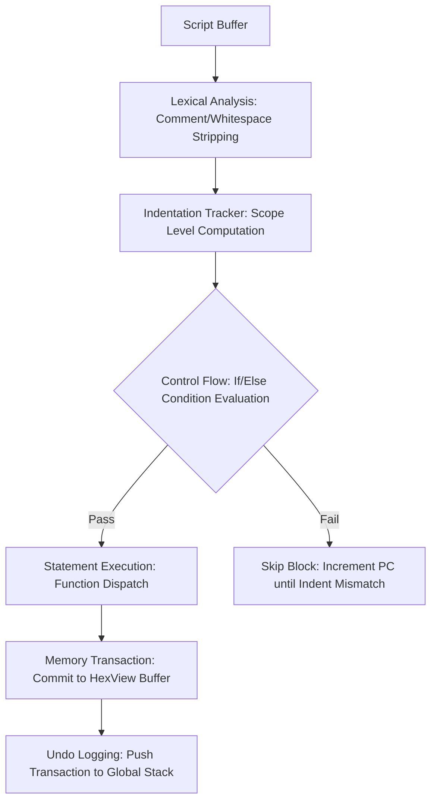

# EUVA Python-DSL Specification

This document defines the specialized Python-like DSL used within the EUVA engine for automated binary patching.

## 1. Design Rationale


The EUVA engine utilizes a Python-style syntax because the assembly language implementation was too complex for most users.
Key technical objectives include:
- **Execution Safety**: Indentation-based scoping allows for conditional execution of patching operations based on signature search results.
- **Maintainability**: High-level abstractions reduce script complexity and improve long-term auditability of patches.
- **Transactional Integrity**: Multiple operations within a single script execution are treated as a unified step in the global `UndoStack`.

## 2. Language Syntax

### 2.1 Block Scoping
Structural blocks are defined by indentation level standard 4 spaces or a single tab. Colon `:` terminators are required for `if` and `else` statements.

### 2.2 Comments
Hash-style (`#`) comments are supported for single-line annotations. Inline comments are permitted after statement code.

### 2.3 Variables and Types
- **Variables**: Identifiers are assigned via the `=` operator.
- **Numerics**: Supports decimal and hexadecimal integers prefixed with `0x`.
- **Strings**: ASCII and UTF-8 string literals are supported for memory writing.

### 2.4 Expressions and Operators
The EUVA DSL supports rich expressions for conditional logic and address arithmetic.

#### Mathematical Operators
Used for address calculation and variable manipulation.
- `+` Addition: Calculates offsets. Example: `offset(base, 0x10 + 4)`
- `-` Subtraction: Calculates relative distances. Example: `read_byte(addr - 1)`

#### Comparison Operators
Used primarily within `if` statements. These operators return `1` True or `0` False
- `==` Equal: Checks for exact equality
- `!=` Not Equal: Checks for inequality.
- `>`  Greater Than: True if left operand is strictly greater than right
- `<`  Less Than: True if left operand is strictly less than right.
- `>=` Greater or Equal: True if left is greater than or equal to right.
- `<=` Less or Equal: True if left is less than or equal to right.

##### Example Usage:
```python
if pe_offset > 0x100:
    log("High offset detected")

if read_byte(addr) == 0x90:
    log("Address already NOPed")
```

#### String Operations
- **Concatenation**: The `+` operator can be used within the `log()` function to join strings and variable values.
  - Example: `log("Address: " + addr)` -> Output: `[Script] Address: 80`

## 3. Core Function Reference

### 3.1 Search & Navigation
- `find(signature: string) -> int`: Performs an Array of Bytes AOB search with wildcard `??` support. Returns the absolute file offset or `-1`.
- `offset(base_addr: int, delta: int) -> int` Performs pointer arithmetic:
  $$ \text{addr} = \text{base\_addr} + \text{delta} $$

### 3.2 Memory Patching
- `write(addr: int, hex_data: string)`: Commits raw hexadecimal bytes to the specified offset.
- `nop(addr: int, size: int)`: Overwrites a memory range with `0x90` NOP instructions.
- `fill(addr: int, size: int, byte: int)`: Populates a range with a single byte value.
- `write_string(addr: int, data: string, encoding: string = "utf8")`: Writes encoded string data. Supported encodings: `utf8`, `utf16`.

### 3.3 Advanced Operations
- `assemble(addr: int, mnemomic: string)`: JIT-assembles x86 instructions into machine code.
- `make_jmp(from_addr: int, to_addr: int)`: Calculates and writes a relative 32-bit jump instruction `E9` The relative offset $rel$ is computed as:
  $$ rel = \text{to\_addr} - (\text{from\_addr} + 5) $$
  where 5 is the length of the `JMP rel32` instruction.

### 3.4 Introspection & Validation
- `read_byte(addr: int) -> int`: Reads an 8-bit value.
- `read_dword(addr: int) -> int`: Reads a 32-bit value respects application endianness.
- `check_bytes(addr: int, expected_hex: string) -> bool`: Validates the content of a memory range

### 3.5 Utilities
- `label(name: string, addr: int)`: Maps a symbolic name to an offset within the execution scope.
- `log(data: any)`: Outputs formatted data to the EUVA Console

## 4. Technical Implementation

The DSL is processed by a linear state-machine interpreter `DslInterpreter`.

### Execution Pipeline


### Key Components

- **Scope Management**: The interpreter tracks `minIndent` to determine block boundaries. If a condition fails, the program counter PC advances while the indentation level remains greater than the current scope.
- **Endianness Transparency**: High-level read functions `read_dword` automatically adjust for the active process endianness.
- **Atomic Commits**: UI updates are dispatched synchronously after the high-level transaction is pushed to the undo stack, ensuring UI consistency.

---

**Implementation Reference**: [MainWindow.xaml.cs](../EUVA.UI/MainWindow.xaml.cs) (Class: `DslInterpreter`)