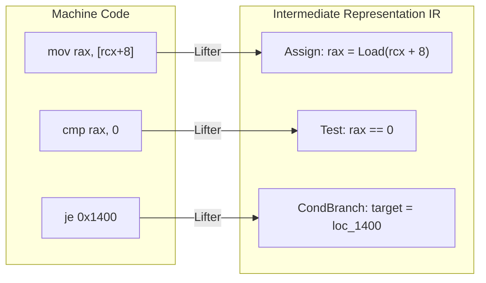
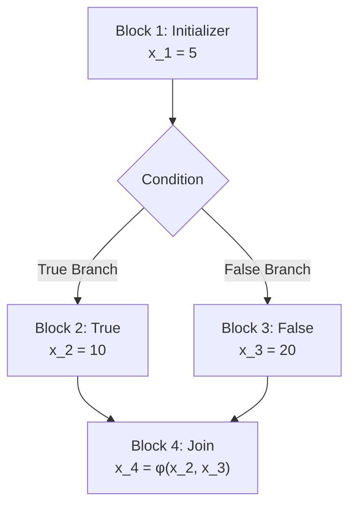
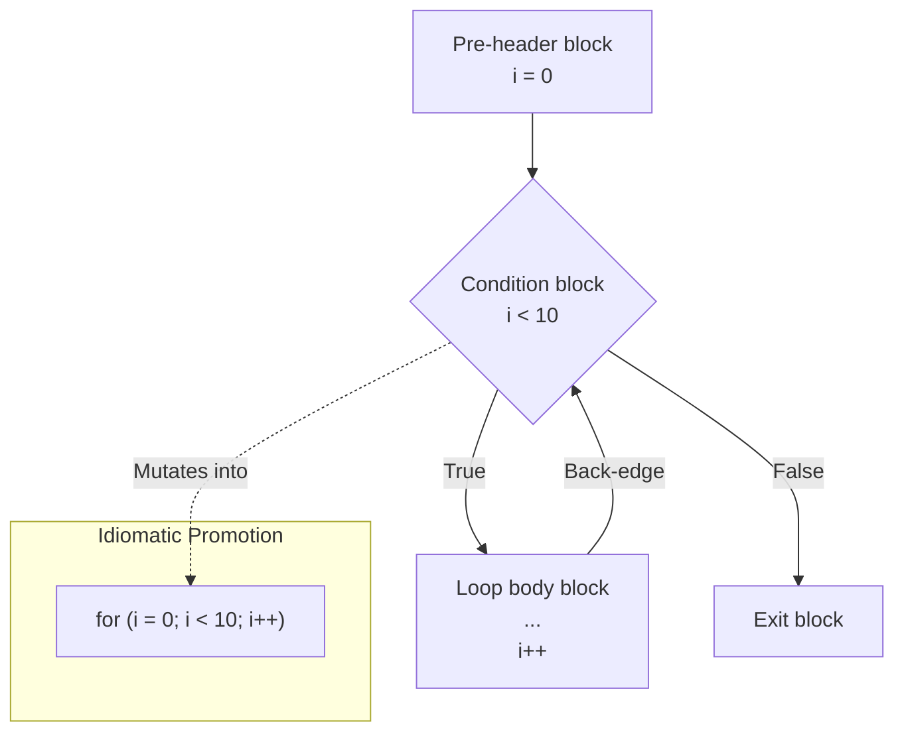

  

# EUVA Decompiler Overview

This document outlines the theoretical foundation, core principles, and architectural design of the EUVA Decompiler. The objective of this engine is to extrapolate high-level, idiomatic semantic representations from discrete machine-level instruction sets.

## 1. Architectural Principles

The EUVA decompiler implements a multi-stage, pipeline-driven architecture. Operations are strictly sequential, with each phase applying successive abstractions over the incoming intermediate representation IR.

### 1.1 Instruction Lifting (IR Translation)
Due to the vast permutation and implicit side-effects of hardware ISAs e.g., x86/x64 flags, complex addressing, direct analysis is intractable. The **IR Lifter** serves to normalize CPU opcodes into bounded, explicit intermediate commands `Assign`, `Add`, `Call`, `Load`, `Store`. This isolation guarantees that subsequent data-flow algorithms remain hardware-agnostic.



### 1.2 Static Single Assignment (SSA)
To achieve precise data-flow traversal, the decompiler relies on **Static Single Assignment (SSA) form**. In SSA, each target destination is assigned exactly once. Recurrent register usage e.g., `rax` is disambiguated via discrete versions `rax_1`, `rax_2`. 

Subsequent divergence in control flow e.g., branching inherently requires variables to merge paths. This is reconciled via the insertion of **Phi ($\phi$) nodes**, which conditionally select the correct SSA version based on the incoming execution block. SSA enforces a traceable def-use chain required for rigorous optimizations.



### 1.3 Data-Flow Optimization Algorithms
Directly translated assembly code exhibits extreme redundancy due to stack constraints and calling conventions. A repetitive optimization loop (cascading passes) is employed to reduce entropy:
* **Copy Propagation:** Identifies contiguous, non-mutating register assignments and structurally collapses them. e.g., `a = b; c = a;` resolves structurally to `c = b;`.
* **Dead Store Elimination (DSE) & Stack Cleanup:** Executes reverse-sweeps of basic blocks to locate and excise volatile memory writes `[base+disp]` that are immediately overwritten without an intervening read operation. Function prologues that establish stack pointers which are never logically consumed are also aggressively pruned.
* **Expression Simplifier & Constant Propagation:** Extrapolates algebraic determinism and collapses variables backed by static immediate values. Additionally, redundant logical operations (e.g., `rax | rax` or `rax & rax`) are automatically simplified.

### 1.4 Abstract Syntax Tree (AST) Expression Folding
Flat IR lists are structurally incompatible with high-level languages like C++. **AST Expression Folding** employs a forward scanning heuristic utilizing SSA `UseCount` properties. Temporary registers possessing an explicit `UseCount == 1` are directly embedded into their destination consumer nodes. Through recursive application within the optimizer pipeline, cascading atomic assignments transform into deeply nested mathematical expressions.

```c
// Before Folding Flat IR / Assembly Equivalent
tmp_1 = t2 >> 11;
tmp_2 = tmp_1 * a2;
t2 = t2 - tmp_2;

// After AST Expression Folding Single Assignment
t2 -= (t2 >> 11) * a2;
```

### 1.5 Control Flow Structuring
Disassembly produces a flat, node-based **Control Flow Graph (CFG)** driven by explicit jumps and conditionals. Structural recovery algorithms analyze dominance and back-edges to extrapolate deterministic C-style control structures.
* Post-dominance verification isolates logical enclosures for `If/Else` blocks.
* Back-edge detection within cyclic loops enables identifying definitive `While` operations. 
* AST Mutation heuristics analyze initialization constraints and step-increments inside `While` boundaries to structurally promote loops into idiomatic `For` nodes.



### 1.6 Advanced Type Inference and ABI Recovery
The semantic meaning of registers is inferred via an advanced, constraint-based **Type Inference Engine** operating on the SSA form, combined with calling convention modeling:
* **Rich Data Model:** SSA variables utilize a `TypeInfo` structure supporting base primitives `Int8` to `Int64`, `Float`, `Struct`, `Void` combined with recursive `PointerLevel` tracking, allowing accurate representation of complex types e.g., `unsigned char**`.
* **Worklist-based Constraint Solver:** A Queue-driven algorithm propagates seeded type constraints deduced from memory load/store instruction widths, exact pointer arithmetic, and WinAPI imports iteratively across the data-flow graph.
* **Bidirectional Propagation:** Type constraints propagate both forward from defined variables to their consumers and backward from strongly-typed destinations pulling type requirements back to their untyped sources.
* **Phi Node Unification:** When execution paths merge inside $\phi$ nodes, the engine executes type unification, strictly favoring specifically typed pointers over ambiguous untyped memory `void*`.
* **ABI Parameter Resolution:** Dynamic mapping of `fastcall`/`cdecl` register states into standard sequential function invocations.
* **VTable Detection:** Heuristics recover dynamic polymorphism patterns, translating opaque indirect function pointers back into Object-Oriented context `this->method()`.

### 1.7 Standard Library Idiom Recognition
Instead of leaving the user to decode manual byte-by-byte loops the Decompiler features an **Idiom Recognizer** pass that executes over the structured AST.
* Fast string operations `rep movsb`, `stosd`, `scasb` lifted from IR are natively bypassed during structuring and cleanly mapped to pseudo-calls like `memcpy` `memset`, and `memchr`.
* The recognizer is capable of collapsing manual `do-while` and `while` loops that match known standard library pointer-arithmetic heuristics, vastly improving readability of memory transfers.

### 1.8 Pseudocode Emission
The terminal stage executes a forward traversal over the reconstructed AST elements. The **Pseudocode Emitter** formats nodes into strings conforming closely to idiomatic C++ semantics. 
* **Condition Propagation:** Backward scanning natively links raw CPU condition flags from math instructions directly into high-level boolean conditionals `>=` `==`, bypassing raw `flag` outputs.
* **Global Data Offsets:** Large cryptographic or static constants representing memory addresses e.g. `0x568000` are automatically intercepted and formatted as global virtual addresses `&g_Data_0xXXX` or explicit symbol imports.
* **Compound Assignments:** Arithmetic combinations map to shorthand operators, isolating temporary SSA suffixes from final outputs

### 1.9 Glass Engine C# Scripting Integration
The standard data-flow and heuristic passes mentioned above operate universally. However, heavily obfuscated code, custom virtual machines, and anti-analysis tricks often require manual intervention. The **Glass Engine** exposes the EUVA Decompiler pipeline to external, runtime-compiled C# scripts, granting users total programmatic control over the IR, AST, and Type Systems without needing to recompile the decompiler itself.

#### 1.8.1 Theory & Pipeline Hooks
The Glass Engine conceptualizes the decompilation pipeline as a series of intercepted states. Scripts can hook into specific checkpoints defined by the `PassStage` enumeration:
* `PreSsa`: Intercept raw IR before variable versioning. Ideal for repairing deliberately broken Control Flow Graphs (e.g., bypassing `ExitProcess` anti-debug traps).
* `PostSsa`: Intercept clean, versioned IR. Ideal for custom pattern matching, such as resolving XOR-obfuscated constants or collapsing proprietary math operations.
* `PreTypeInference`: Intercept the graph before types are guessed. Ideal for injecting manual knowledge e.g., forcing a register to be recognized as a `_PEB*` pointer based on its address.
* `PostTypeInference`: Fix incorrectly guessed types.
* `PostStructuring`: Intercept the final AST to rewrite conditional logic or simplify complex boolean expressions before pseudocode emission.

#### 1.8.2 Under the Hood: High-Performance Delegates
To maintain extreme performance across binaries containing thousands of functions, the Glass Engine does **not** compile scripts on the fly for every function. 
Instead, it utilizes the Roslyn Compiler `Microsoft.CodeAnalysis.CSharp.Scripting` in a highly optimized manner:
1. **Application Startup `InitializeAsync`**: The `ScriptLoader` searches the application's `Scripts/` directory for `.cs` files.
2. **One-Time Compilation**: It reads each script and compiles the syntax tree into memory exactly **once** using `CSharpScript.Create<IDecompilerPass>(...).CreateDelegate()`. This converts the C# text into a native, executable function pointer (delegate).
3. **Per-Function Invocation `PrepareFunctionPassesAsync`**: When a new function is analyzed, the pre-compiled delegates are instantaneously invoked to spawn fresh instances of the user's `IDecompilerPass`. This eliminates syntax parsing overhead during analysis loops, allowing scripts to execute in microseconds.

#### 1.8.3 Usage Guide
To write a script, simply create a new `.cs` file in the `Scripts/` directory located next to the main EUVA executable. 
A script requires only two things:
1. It must implement the `IDecompilerPass` interface.
2. It must return a new instance of itself at the bottom of the file (as it is evaluated as a Roslyn script expression).

**Example: A Simple Log Pass**
```csharp
using System;
using EUVA.Core.Scripting;
using EUVA.Core.Disassembly.Analysis;

public class MyLoggerPass : IDecompilerPass
{
    // 1. Choose WHEN this script runs e.g., right after CFG creation, before SSA
    public PassStage Stage => PassStage.PreSsa;

    // 2. Implement the Execution logic
    public void Execute(DecompilerContext context)
    {
        // The context object gives you full access to the current function's IR blocks
        Console.WriteLine($"Analyzing function at 0x{context.FunctionAddress:X}");
        
        foreach (var block in context.Blocks)
        {
            foreach (var instr in block.Instructions)
            {
                // You can read, modify, or delete instructions here.
                if (instr.Opcode == IrOpcode.Xor) 
                {
                   // Do something custom...
                }
            }
        }
    }
}

// 3. Return the instance so the Glass Engine can load it
return new MyLoggerPass();
```
Upon saving this file to `Scripts/MyLoggerPass.cs` and launching EUVA, the ScriptLoader will automatically compile it, inject it into the `DecompilationPipeline`, and execute your logic every time a function is analyzed.

---

## 2. Directory and Source File Mapping

The following catalog provides contextual indexing of the core EUVA repository mechanisms and their respective implementations.

### Engine Configuration & Execution
* [DecompilerEngine.cs](../EUVA.Core/Disassembly/DecompilerEngine.cs) - Main interface exposing asynchronous analysis requests and engine parameters.
* [DecompilationPipeline.cs](../EUVA.Core/Disassembly/Analysis/DecompilationPipeline.cs) - The orchestrator housing the sequential execution phases and cyclic optimization loops.

### Intermediate Representation Model
* [IrLifter.cs](../EUVA.Core/Disassembly/Analysis/IrLifter.cs) - Instruction decoder lifting `Iced.Intel` structures into IR models.
* [IrInstruction.cs](../EUVA.Core/Disassembly/Analysis/IrInstruction.cs) - Base data model containing Opcodes, operand sources, and destination indices.
* [IrOperand.cs](../EUVA.Core/Disassembly/Analysis/IrOperand.cs) - Operational variables encompassing Immediate Constants, Registers, Stack Slots, and nested Expressions.

### Graph and Data-Flow Analyzers
* [SsaBuilder.cs](../EUVA.Core/Disassembly/Analysis/SsaBuilder.cs) - Implementation for executing Dominance Frontiers, variable def-use tracking, and dynamic Phi-node injection.
* [DeadCodeElimination.cs](../EUVA.Core/Disassembly/Analysis/DeadCodeElimination.cs) - Recursive UseCount tracker and reverse-block Dead Store Elimination execution.
* [ExpressionInliner.cs](../EUVA.Core/Disassembly/Analysis/ExpressionInliner.cs) - The primary engine executing the fusion of temporary IR elements into nested AST expressions.
* [CopyPropagation.cs](../EUVA.Core/Disassembly/Analysis/CopyPropagation.cs) - Algorithmic reduction of unneeded intermediate variable transitions.

### Control Flow Recovery
* [DominatorTree.cs](../EUVA.Core/Disassembly/Analysis/DominatorTree.cs) - Graph-theory implementation calculating domination dependencies across BasicBlocks.
* [ControlFlowStructurer.cs](../EUVA.Core/Disassembly/Analysis/ControlFlowStructurer.cs) - Core structured transformation routines isolating `If`, `While`, `For` loop patterns.
* [LoopDetector.cs](../EUVA.Core/Disassembly/Analysis/LoopDetector.cs) - Evaluates block back-edges for loop determination.

### Semantics & Emitted Output
* [PseudocodeEmitter.cs](../EUVA.Core/Disassembly/Analysis/PseudocodeEmitter.cs) - Transforms memory-resident structured ASTs into linear textual Pseudocode outputs with conditional context propagation.
* [CallingConventionAnalyzer.cs](../EUVA.Core/Disassembly/Analysis/CallingConventionAnalyzer.cs) - Maps processor state against functional calling paradigms targeting function signatures.
* [TypeInference.cs](../EUVA.Core/Disassembly/Analysis/TypeInference.cs) - Assigns explicit memory types via propagation analysis.
* [StructReconstructor.cs](../EUVA.Core/Disassembly/Analysis/StructReconstructor.cs) - Discovers structured memory offset patterns representing class/struct definitions.

### Presentation Layer
* [DecompilerTextView.cs](../EUVA.UI/Controls/Decompilation/DecompilerTextView.cs) - Windows Presentation Foundation logical view binding formatting strings with UI presentation layouts.
* [DecompilerGraphView.cs](../EUVA.UI/Controls/Decompilation/DecompilerGraphView.cs) - Renders mathematical execution graphs associated with structural components.
